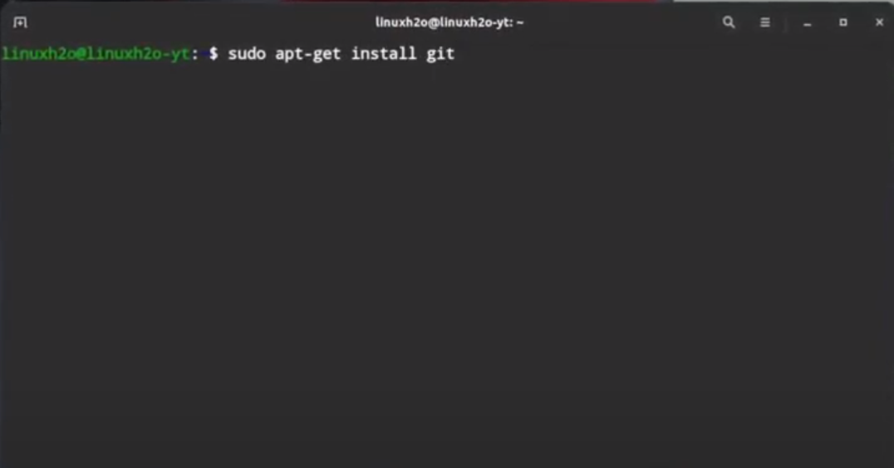

   **TUTORIAL DE INSTALAÇÃO DO GIT**
=========

### *INSTALANDO O GIT DE MANEIRA RÁPIDA PARA O LINUX*
-------------
 

  Instalar o GIT no sistema Linux é **extremamente fácil e rápido**, sendo apenas necessário seguir os seguintes passos na ordem descrita:
  

  1. Abra o terminal do Linux de acordo com a versão disponível:
  
  
  
  2.  Digite o Comando Padrão "sudo apt-get update" e em seguida aperte o "Enter" para atualizar o repositório:
  
  
   
3. Digite o Comando "sudo apt-get install git" e em seguida aperte o "Enter":
  
  
  
   4. Feito isso, o GIT já estará disponível em sua máquina, sendo apenas necessário configurá-lo com as informações e preferências pessoais do usuário.
  
  **Pronto! Você  já pode iniciar a configuração do GIT e em seguida a utilização da aplicação** :smiley: