   **TUTORIAL DE MANUSEIO DO GIT**
=========

### *COMANDOS BÁSICOS*
-------------
O GIT é um sistema de controle de versão desenvolvido por *Linus Torvalds*, o famoso criador do kernel do sistema operacional Linux. Atualmente, pode-se dizer que o GIT é o DVCS **mais usado no mundo**, por isso destaca-se a importância de conhecimento dessa ferramenta. A seguir, você encontrará um tutorial explicando a funcionalidade e a maneira de execução de alguns comandos básico **essenciais** do GIT. Vamos nessa? :facepunch:

1. **Identidade**:
O primeiro comando básico que vamos abordar nesse tutorial é o de **criação de identidade**. Esse comando permite o usuário do GIT criar no programa seu perfil e atrelá-lo ao seu e-mail de preferência, seja pessoal ou profissional. Trata-se do **primeiro passo** após a instalação do GIT, pois esse comando permite uma gama maior de organização em relação à sua identidade.

*Para criar seu perfil, digite o seguinte comando no prompt do GIT e aperte "Enter":* git config --global user.name

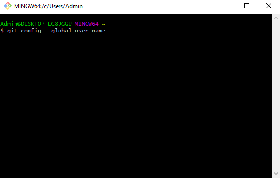

*Para atrelar seu e-mail ao perfil e ao programa, digite o seguinte comando no prompt do GIT e aperte "Enter":* git config --global user.email

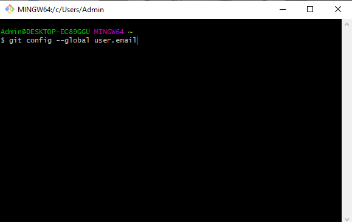

*Inserindo suas informações pessoais de acordo com a interface do GIT gerada pelos códigos acima, seu cadastro de identidade já se encontra finalizado. Você pode conferir se tudo foi cadastrado corretamente digitando os códigos novamente, sendo que agora aparecerá suas informações no GIT:*

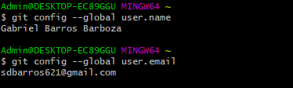

2. **Inicialização:** Após ter configurado corretamente o GIT com a sua identidade, podemos dar início à utilização do programa em si. Nesse passo, trataremos sobre a inicialização, o primeiro comando a ser executado sempre que se tiver a intenção de realizar um trabalho no GIT.

*Para iniciar no GIT, digite o seguinte comando no prompt do GIT e aperte "Enter":* git init

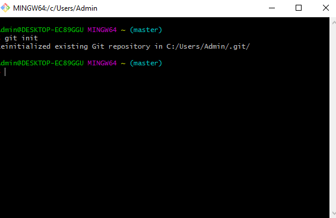

Feito isso, você irá iniciar um novo repositório ou reabrir um já existente, como demonstra a imagem acima. Outros comandos importantíssimos do GIT com relação ao processo de inicialização são:

* **GIT Remote**: O comando git remote é, em essência, uma interface para gerenciar uma lista de entradas remotas que são armazenadas no arquivo. Para executá-lo, basta digitar digite o seguinte comando no prompt do GIT e apertar "Enter": git remote

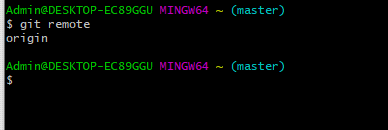

Como se pode notar, o repositório padrão é chamado de *"origin"*, que é um alias para o nome completo do repositório.

* **GIT Clone**: O comando git clone é, de maneira literal, um comando para clonar um repositório.  Para executá-lo, basta digitar o seguinte comando no prompt do GIT e apertar "Enter": git clone [url do repositório a ser clonado]

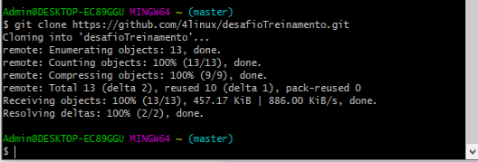

Como podem ver na imagem acima, o exemplo utilizado fora o repositório do desafio teste da 4Linux, que junto ao comando do git clone, realizou uma cópia.

3. **Modificação:** Nessa etapa, encontra-se  todo o processo de alterações nos arquivos que constam dentro do repositório utilizado:

 * **git add** [arquivos]: Este comando adiciona o(s) arquivo(s) em um lugar que chamamos de INDEX, que funciona como uma área do git no qual os arquivos possam ser enviados ao Github. É importante saber que ADD não está adicionando um arquivo novo ao repositório, mas sim dizendo que o arquivo (sendo novo ou não) está sendo preparado para entrar na próxima revisão do repositório.
 
 * **git rm** [arquivos]: O comando git rm serve para remover arquivos que já foram adicionados ao git directory (arquivos que já foram comitados).

* **git commit** -m "comentário qualquer": Este comando realiza o que chamamos de “commit”, que significa pegar todos os arquivos que estão naquele lugar INDEX que o comando add adicionou e criar uma revisão com um número e um comentário.

* **git push**: É usado para publicar todos os seus commits para o github.

* **git pull**: Ainda existe um comando importante neste processo, que é o git pull. Ele é usado para trazer todas as modificações que estão no github para o seu projeto local.

*Brevemente explicado cada comando básico da fase de modificação, segue imagens para elucidar melhor o conteúdo exposto:*

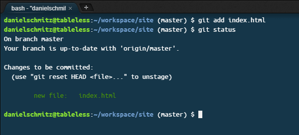

<small>**git add**</small>

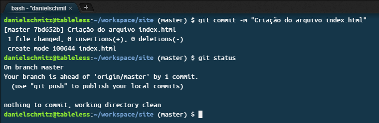

<small>**git commit**</small>

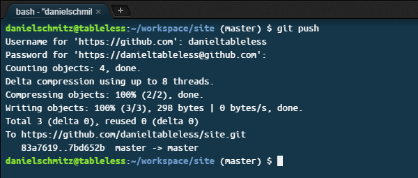

<small>**git push**</small>

<small>**git pull**</small>

*Nessa sequência de imagens, vemos um trabalho realizado no GIT do início, desde o momento de adcionar arquivos ou mudanças no repositório, realizar o commit e o push/pull. Este exemplo foi fornecido por Daniel Schmitz, disponível em: https://tableless.com.br/tudo-que-voce-queria-saber-sobre-git-e-github-mas-tinha-vergonha-de-perguntar/*

4. **Inspeção**: Esta é a etapa onde o usuário pode descobrir informações à respeito do status dos arquivos do seu repositório:

* **git status**: Este comando exibe o status do seu repositório atual:

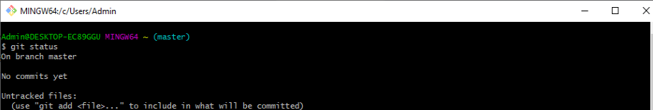

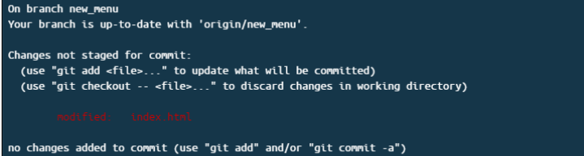

* **git log**: Este comando exibe uma espécie de relatório dos commits efetuados no seu repositório e commits pré-existentes em repositórios clonados.

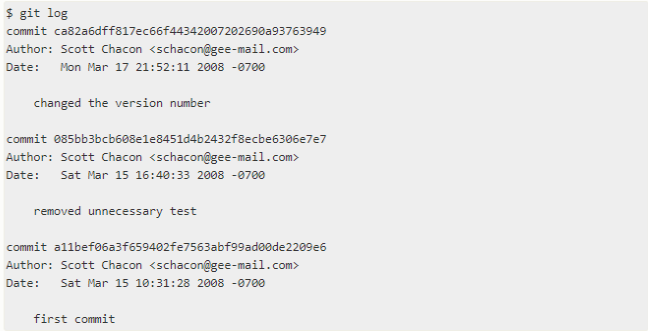

*Como se pode notar, as imagens mostram alterações efetuadas nos processos envolvendo o repositório ou arquivos que se manterem intactos, sem nenhuma alteração.*

E com isso, **finalizamos** este tutorial dos comandos básicos do GIT. Com o que fora exposto, você já deve ser capaz de executar algumas tarefas simples nessa aplicação. Até a próxima! :wave: